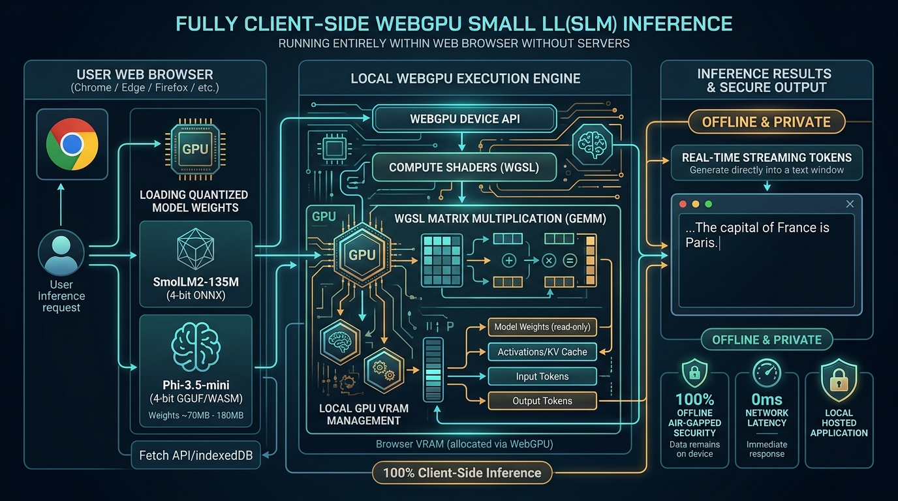

# WebGPU In-Browser Small LM Studio

[](LICENSE)
[](.github/workflows/sre-validation.yml)
[](https://www.python.org/)
[](https://w3c.github.io/webgpu/)
[](https://talaripradeep.info/tools/webgpu-browser-slm/)

Run quantized Small Language Models (**SmolLM2-135M / Phi-3.5-mini 4-bit**) directly inside client web browsers using the native **WebGPU Device API** and **WGSL GEMM compute shaders**. Delivers **100% offline air-gapped privacy**, **0ms network roundtrip latency**, and zero server hosting expense.

---

## 🏛️ Architecture Flow Diagram



---

## 🎬 3Blue1Brown / Manim Programmatic Video Generator

This repository includes a production-grade **Manim** (`manim_flow.py`) animation script rendering WebGPU compute shaders and local buffer allocations.

```bash
# 1. Install animation manifest
pip install -r requirements-animation.txt

# 2. Render fast preview
manim -pql manim_flow.py WebGPUBrowserSLMScene

# 3. Render Ultra HD 4K 60fps
manim -pqk manim_flow.py WebGPUBrowserSLMScene
```

---

## 🚀 Quickstart & Validation

```bash
git clone https://github.com/Pradeeptalari14/tp-webgpu-browser-slm.git
cd tp-webgpu-browser-slm

# Install core runtime dependencies
pip install -r requirements.txt

# Run SRE validation suite
bash scripts/validate.sh
```

---

## 📂 Repository Layout

```text
├── .github/workflows/
│   └── sre-validation.yml
├── docs/
│   └── webgpu_browser_slm_flow.png
├── scripts/
│   └── validate.sh
├── server_fallback.py         # Mock diagnostic server & fallback API
├── webgpu_engine.ts           # WGSL compute shader matrix multiplication
├── k8s-webgpu-client.yaml     # Kubernetes asset CDN manifest
├── docker-compose.yml
├── requirements.txt           # Core HTTP runtime dependencies for fast CI
├── requirements-animation.txt # Manim 4K animation dependencies
├── manim_flow.py              # 3Blue1Brown/Manim programmatic 4K video animation
├── package.json
├── LICENSE
├── SECURITY.md
└── README.md
```
